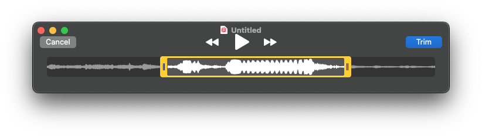

I went through a fun two-day project recently where I wanted to leave a lasting impression
in the final outcome. 20 minutes before presenting it, I hopped on duckduckgo to ask "how can I record
MP3 files in my Macbook" and 6 minutes later, my little demo was chirping.

Firstly - a good microphone goes a long way. Even a cheap lapel mic goes a long way, or maybe your old wired headphones have one?
I luckily happen to have one for Zoom calls anyway (everyone wanted to be a podcaster during the COVID pandemic... right?)
If you have to resort to using your laptop's own microphone, I would suggest using your phone's memo recorder instead then.

On MacOs you can do it very conveniently via QuickTime - go to `File > New Audio Recording (⌘ + ⇧ + N)` and a small recorder opens up with a barebones interface. Note that once you hit record, you _can_ start speaking straight away, but I was rather paranoid and always left a full second buffer period. You can use props, but I found just making the sounds with your mouth had
a very charming and human touch to it.

You can then optionally trim the file via `Edit > Trim` to cut down the track to be as close to the actual sound portion as possible. The soundwave comes in handy for that!



Lastly, `File > Export as... > Audio only` and you can save it as an M4A file, which is exactly what we want. At first,
based on my outdated knowledge, I was adamant to go and convert it to MP3, but all browsers (even Internet Explorer!)
support M4A & it offers better quality at lower bitrates than MP3.

The way I usually include audio files in my project is via a small utility or "audio mapping", where I can cache the loaded
files and call them conveniently with `playSound('clipName')`:

```ts
import boopSound from '../assets/boop.m4a'
import swooshSound from '../assets/swoosh1.m4a'

const audioCache: Record<string, HTMLAudioElement> = {}

export const playSound = (sound: 'boop' | 'swoosh1') => {
  try {
    const soundMap = {
      boop: boopSound,
      swoosh1: swooshSound,
    }

    const soundUrl = soundMap[sound]

    if (!audioCache[sound]) {
      audioCache[sound] = new Audio(soundUrl)
      audioCache[sound].volume = 0.6
    }

    const audio = audioCache[sound]
    audio.currentTime = 0
    audio.play().catch(console.error)
  } catch (error) {
    console.error('Could not play sound:', error)
  }
}
```

Now if you'd have a huge amount of files (or they'd be hefty in filesize), I'd recommend dynamic imports and not loading them
up front. But for something small (and where the sound files are usually ~30kB), I think this is Good Enough™

Go ahead and test it out:

<button data-sound="swoosh" type="button">
Send
<svg xmlns="http://www.w3.org/2000/svg" width="24" height="24" viewBox="0 0 24 24" fill="none" stroke="currentColor" stroke-width="2" stroke-linecap="round" stroke-linejoin="round" class="feather feather-send"><line x1="22" y1="2" x2="11" y2="13"></line><polygon points="22 2 15 22 11 13 2 9 22 2"></polygon></svg>
</button>

For my blog, I've extended the utility to automatically find the sound from a `data-sound` property, making it easy to sprinkle
in a bit of personality here and there.