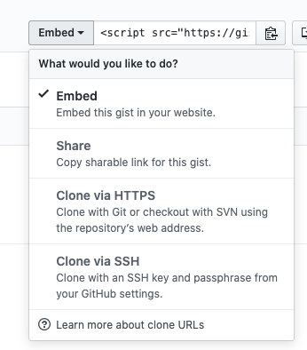

A friend of mine recently asked if they can upload an image to a gist.
Not only will we walk through how to do that, but I'll also show you
how you can display a preview image of your gist!

## unveiling  the secret

A couple of years ago, a whole new world opened up when I learned that gists are
also simply [git repositories](https://help.github.com/en/enterprise/2.13/user/articles/about-gists).
That's right - you can clone that innocent note
locally or have some code push to it automatically. There are actually a
[zillion](https://www.labnol.org/internet/github-gist-tutorial/28499/)
different things you can do with Gists, from storing your pancake recipes to hosting single-page static sites!

The clone command is tucked away, but you can still find it from the UI by
clicking on the `Embed` button, which opens up a popup menu, where you can
find both HTTPS and SSH cloning options.



Your clone link will include the gist's ID that you can also find from the URL, so you can put it together programmatically, for example
```
# Link to your Gist
https://gist.github.com/andreasvirkus/473a28a9b6c6268c9220546642952faa

# Clone URL
git@gist.github.com:473a28a9b6c6268c9220546642952faa.git
# Meaning you gotta
git clone git@gist.github.com:473a28a9b6c6268c9220546642952faa.git
```

If you now add an image to your newly cloned gist repo
```
git add preview.png
git commit -m "Add preview image" && git push
```

Then you could, for example, link to it directly from your gist's `README.md` file
```

```

Now you know how to display images in gists and (maybe even more importantly) that
gists are full-fledged git repositories! May you use your new powers wisely.

